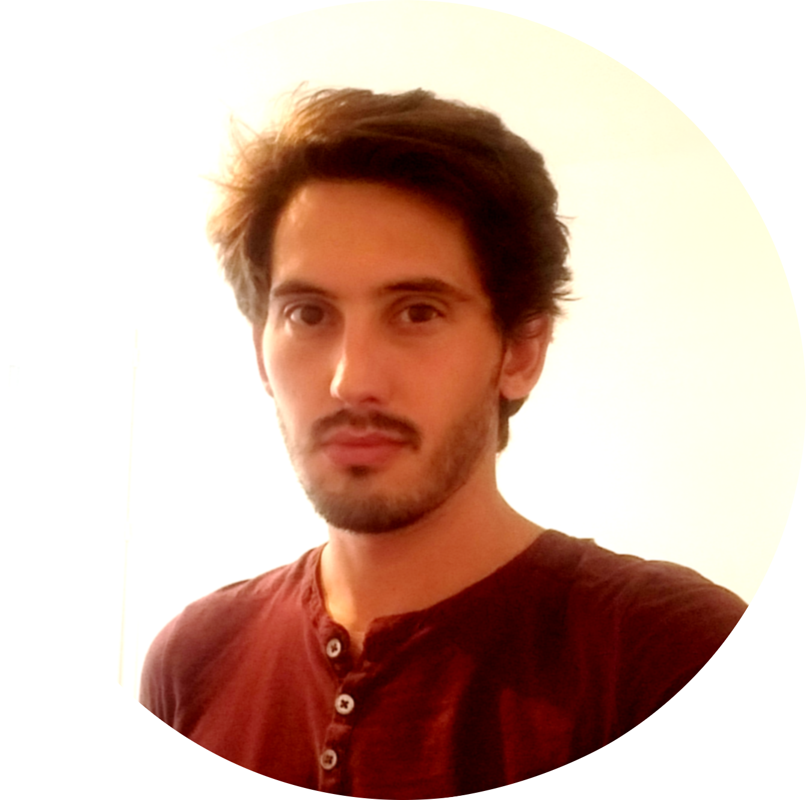

I am interested in modeling the relationship between environment, demography and
genetics in spatially and temporally heterogeneous environments, using [coalescence
approaches](https://en.wikipedia.org/wiki/Coalescent_theory). This kind of models
allow to shed light on the ecology of a species (dispersal abilities, growth
capacities…) from observational data, genetic data, and environmental data.

Under such complex models, [likelihood](https://en.wikipedia.org/wiki/Likelihood_function)-based inferential methods are useless, and
 [_Approximate Bayesian Computation_](https://en.wikipedia.org/wiki/Approximate_Bayesian_computation) is a natural way to tackle this
kind of models as it makes use of simulations to estimate parameters. This need for
massive simulations justifies my principal activity of C++ programming.

I maintain [Quetzal](quetzalAPI/html/index.html), a C++ template library easing the development of
coalescence-based models.
