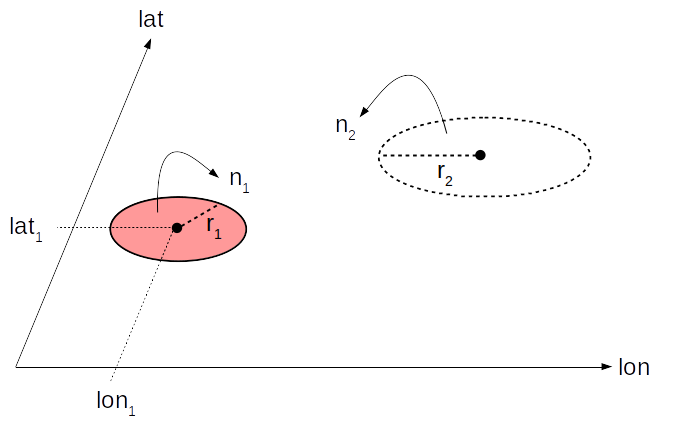
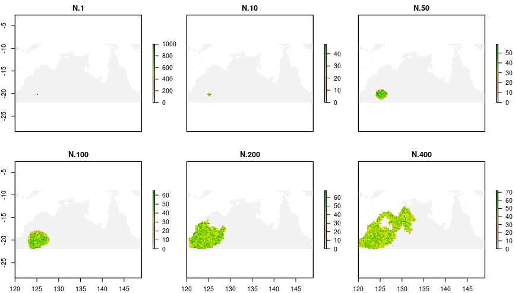
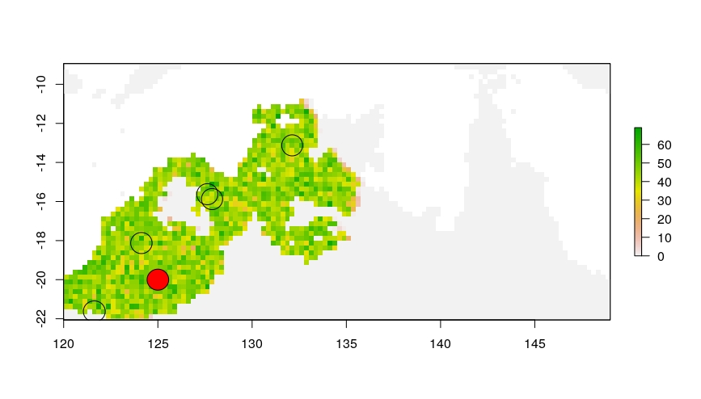
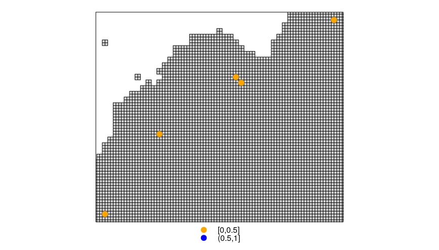
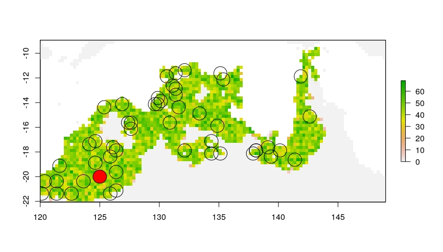
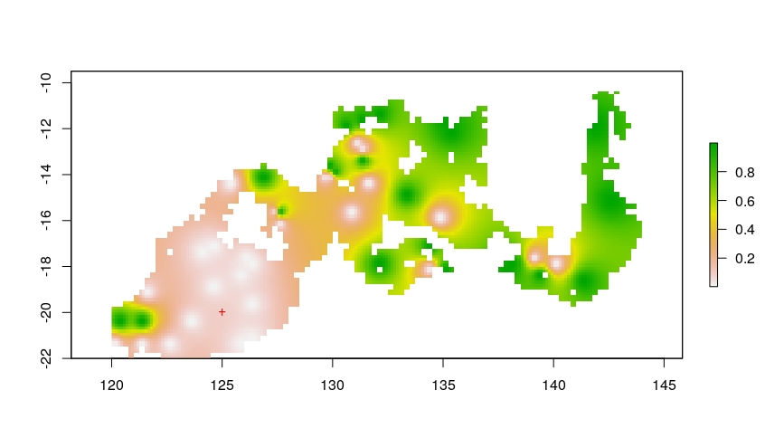

# Decrypt

## Summary

Decrypt is a tool allowing to shed light on systems where cryptic diversity and
isolation by distance are two competing hypothesis. Decrypt can help understanding
if the genetic structure detected under the MultiSpecies Coalescent, MSC, could possibly
be explained by the intra-species spatial structure.

It can be seen as a way to automate MSC robustness analyses for different realistic demographic histories
and spatial sampling schemes.

The Decrypt C++ demogenetic simulation core has been developed using the Quetzal library.
It generates a spatially explicit demographic history incorporating environmental
heterogeneity. At sampling time, it simulates gene trees under different sampling schemes.

In the current version, sampling schemes are quite simplistic. Each scheme is defined
by two clusters of individuals, defining two sampling populations $P_1$ and
$P_2$.
- $P_1$, the red circle in the following picture, is fixed for all simulations at a user-defined location $(lon_1, lat_1)$.
At sampling time, $n_1$ gene copies are sampled uniformly in a radius $r_1$ around this
coordinate.
- $P_2$, white circle, is a population which location varies across simulations: it is uniformly sampled in the distribution
area. At sampling time, $n_2$ gene copies are sampled uniformly in a radius $r_1$.



## Installation

The following instructions allow to install decrypt on an Ubuntu environment.

### Dependencies

We first need to install three main dependencies.
- the Geospatial Data Abstraction Library (GDAL) is useful to represent a
spatially explicit landscapes.
- Boost is an important code resource for C++ dev that covers a wide range of problems.
- SQLite3 is a lightweight database software we use to store intermediary results.

Open a terminal and type
```
sudo apt-get install libgdal-dev libboost-all-dev sqlite3
```
Thenm to install BPP, the species delimitation software used here, follow the instructions provided on the [project github page](https://github.com/bpp/bpp).

> **Reference:** Flouri T., Jiao X., Rannala B., Yang Z. (2018) Species Tree Inference with BPP using Genomic Sequences and the Multispecies Coalescent. Molecular Biology and Evolution (accepted manuscript). doi:10.1093/molbev/msy147

### Get Decrypt source code

Two options are possible here, up to you:

#### You are not interested in future Decrypt features

You may just want to download the [latest release of the project](https://github.com/Becheler/decrypt/releases).

#### You want to benefit from further developments

Then you should prefer to clone the github project, so you can update the decrypt pipeline
whenever you want. To clone the project, you need git, so first be sure that git is installed in your system.

To do so, simply open a terminal, type ``git --version`` and press Enter.

If the terminal answers something like ``git version 2.17.1``, it's good: git is already installed.
If it is not the case, then check the [git website](https://git-scm.com/) for proper installation.

Once you have successfully installed git, then open a terminal, chose a suitable
folder in your file system, and type:

```
git clone https://github.com/Becheler/decrypt.git
```

### Build, test and install

Create a directory ```sandbox``` somewhere on your computer. We will use it
as both an install location and an application directory the time for us to package the software better.

At this point, go to the ``decrypt`` directory, build the project, run the tests and install
the project to the ```sandbox``` location

```
cd decrypt
mkdir build
cd build
cmake .. -DCMAKE_INSTALL_PREFIX=path/to/the/sandbox/directory
make
make test
make install
```

If the tests and the installation end without problems, there is now a directory
``sandbox/decrypt``.

# Application

## Example configuration files

The install location contains an ```example``` directory where
you can find:
- a landscape (a .tiff file representing the rainfall in North Australia)
- ```spatial_process.ctl```: a configuration file to set parameters of the spatial spatial process
- ```bpp.ctl```: a configuration file for BPP

## Running the spatial process

In a terminal, go to the sandbox directory and run the following:
```
cd path/to/sandbox
chmod +x decrypt/spatial_process
mkdir output
./decrypt/spatial_process --config decrypt/example/spatial_process.ctl
```

If the program runs correctly, you should see in the terminal if the demographic
history has been simulated, and then a progress bar that indicates
how advanced the pseudo-observed data generation is:
```
--- Expanding demography
--- Simulating coalescents

0%   10   20   30   40   50   60   70   80   90   100%
|----|----|----|----|----|----|----|----|----|----|
***************************************************
```

This program creates a bunch of files in the ```output``` directory that give access
to various aspects of the demographic process. We will be able to visualize them
later using the small R library ```decrypt/decrypt.R```. Now we will focus on analyzing
the simulated coalescents that have been stored in the ```output/test.db``` database.

## Performing species delimitation under the MSC using BPP

In the ```sandbox``` directory, create a Python virtual environment to avoid polluting your system, activate it
and install the python dependencies:

```
virtualenv ENV
source ENV/bin/activate
pip install pandas matplotlib seaborn pyvolve
```

Ask what options the ```decrypt/decrypt.py``` program takes:

```
python3 decrypt/decrypt.py --help
```
The output is:
```
Options:
  -h, --help        show this help message and exit
  -d DATABASE       path to database
  -l SEQUENCE_SIZE  sequence_size
  -s SCALE_TREE     scale tree branch length
  -b BPP            path to bpp executable
  -c BPP_CTL        path to bpp config file
```

If you copy the BPP executable into the sandbox directory, you can run the following command line:

```
python3 decrypt/decrypt.py -d output/test.db -l 100 -s 0.000001 -b bpp -c decrypt/example/bpp.ctl
```
The program will iterate through each gene genealogy simulated with ```spatial_process```,
evolve sequences along branches and perform
species delimitation on this pseudo-observed data. When the BPP analysis is done,
a dataframe ```data.txt``` is generated giving for each sampling scheme the probability to detect
more than one species.

We can then use the R library to visualize the results.

## Visualization with R

Open R and set ```sandbox``` as being the working directory.
```
# Load some tool functions
source("decrypt/decrypt.R")
```
### Inspect the demographic history

#### Snaps

The parameter ```demography_out=output/N.tif```  in ```spatial_process.ctl```
creates a tif file to record the demographic history (leave this parameter blank
to avoid the cost of creating this file for longer times).

It allows to inspect the effect of different parametrizations of the spatial process.

```
# Read the geotiff file created by spatial_process
history <- stack("output/N.tif")
# Subset history for different times and plot
snaps <- subset(history, list(1,10, 50, 100, 200,400))
plot(snaps)
```



#### Movie

Sometimes it is easier to understand the process through an animation.
We use here the command ```convert``` that is part of the ImageMagick package,
which comes with many Linux distributions.

```
# Create a directory to store intermediary files
dir.create("movie")
working_folder <- paste0(getwd(),"/movie")
ordered_times <- 1:400
# Standardize the plots legends with an expected maximal N value in the dataset
# like the maximal carrying capacity
max_N_value <- 100
make_movie(history, ordered_times, max_N_value, working_folder)
```

<video src="../demo/decrypt/movie.mp4" width="640" height="400" controls preload></video>

#### Potential pitfalls with ImageMagick

If the time range is too wide or the landscape too wide, the default settings of
ImageMagick package may be insufficient. You can check the current settings by
typing ```convert -list resource``` in a terminal. You may need to change these
default values: [check this page](https://imagemagick.org/script/security-policy.php).
To handle long histories, our configuration has been set to:
 ```
 Resource limits:
  Width: 128KP
  Height: 128KP
  Area: 1.0737GP
  Memory: 2GiB
  Map: 4GiB
  Disk: 8GiB
  File: 768
  Thread: 4
  Throttle: 0
  Time: unlimited
```

### Inspect the sampling schemes

In the spatial process configuration file, we limited the number of simulations to
5 sampling schemes, each one composed of:
- 1 sampling cluster fixed on a given coordinate
- 1 sampling cluster that varies uniformly across the distribution area

Within a radius of 30km each of these coordinates, 30 individuals are sampled uniformly.
These parameters can be change in the ```spatial_process.ctl``` configuration file.

```
data <- read.csv("data.txt")
mask <- history[[nlayers(history)]]
x0 <- data.frame("lon" = c(125), "lat" = c(-20))
plot_sampling_scheme(mask, x0=x0, r0=30000, x=data[,c('lon','lat')], r=30000, proj4string=crs(mask))
```

The previous lines allow to plot the fixed sampling cluster (in red) and the
5 varying clusters with their respective radius (black at sampling time circle) on top of the spatial
distribution of the population sizes at sampling time (colors).



### Posterior probability

### In short
To visulize the combined effects of departures from the MSC model hypothesis and
sampling scheme, you can either look at the raw posterior probabilities, or perform
a spatial interpolation of this probability.
```
mask2 <- disaggregate(mask,fact=2)
raw_posterior_probability(data=data, mask=mask2, proj4string=crs(mask))
interpolate_posterior_probability(data=data, mask=mask2, x0=x0, proj4string=crs(mask))
```


Of course, the example that was developed here focus on a quite recent history
(400 generations), and then test only 5 alternative sampling points. This is
computationally tractable for a demo, but it is not an ideal situation to
perform a spatial interpolation, so we will show the related figure.

### Larger dataset

We provide in the ```decrypt/example``` directory two supplementary files giving
the results of a more substantial analysis on longer times with
more intensive sampling scheme:

- ```data_extract.txt```: a larger dataset for proper interpolation
- ```last_N.tif```: The ```spatial_process``` program can also generate this file,
that gives access to the population distribution area.

You can run:
```
data <- read.csv("decrypt/example/data_extract.txt",header=TRUE)
mask <- raster("decrypt/example/last_N.tif")

x0 <- data.frame("lon" = c(125), "lat" = c(-20))
plot_sampling_scheme(mask, x0=x0, r0=30000, x=data[,c('lon','lat')], r=30000, proj4string=crs(mask))
mask2 <- disaggregate(mask,fact=2)
raw_posterior_probability(data=data, mask=mask2, proj4string=crs(mask))
interpolate_posterior_probability(data=data, mask=mask2, x0=x0, proj4string=crs(mask))
```



## Adapting the simulation
