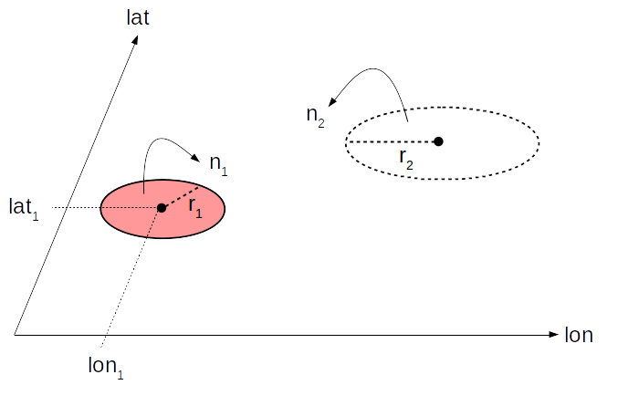

# Decrypt

## Summary

Decrypt is a tool allowing to shed light on systems where cryptic diversity and
isolation by distance are two competing hypothesis. Decrypt can help understanding
if the genetic structure detected under the MultiSpecies Coalescent, MSC, could possibly
be explained by the intra-species spatial structure.

It can be seen as a way to automate MSC robustness analyses for different realistic demographic histories
and spatial sampling schemes.

The Decrypt C++ demogenetic simulation core has been developed using the Quetzal library.
It generates a spatially explicit demographic history incorporating environmental
heterogeneity and random population persistence in unsuitable areas.
At sampling time, it simulates gene trees under different sampling schemes.
Then, sequences are simulated along the gene trees, and BPP is run for species delimitation.

## Sampling scheme under Decrypt

In the current version, sampling schemes are quite simplistic. Each scheme is defined
by two clusters of individuals, defining two sampling populations $P_1$ and
$P_2$.
- $P_1$, the red circle in the following picture, is fixed for all simulations at a user-defined location $(lon_1, lat_1)$.
At sampling time, $n_1$ gene copies are sampled uniformly in a radius $r_1$ around this
coordinate.
- $P_2$, white circle, is a population which location varies across simulations: it is uniformly sampled in the distribution
area. At sampling time, $n_2$ gene copies are sampled uniformly in a radius $r_1$.



# Popgen Workshop demonstration

# Go to the proper location

In a terminal, go to the sandbox directory and run the following:
```
cd /home/popgen/software/decrypt/toto/sandbox
ls
```

This directory contains various folders:
- ```sandbox/decrypt``` a folder where the project has been installed along with several examples files
- ```sandbox/play_with_demography``` a demonstration folder for discovering the demographic simulation tool
- ```sandbox/play_with_robustness``` a demonstration folder to visualize pre-computed results
- ```sandbox/output``` a temporary output folder to store simulations results

## Example configuration files

The ```sandbox/decrypt``` folder contains:
- a ```spatial_process``` executable for simulating a demographic history and generating gene trees
- an ```example``` directory where you can find:
  - ```australia_precipitation_6032.tif``` a raster representing the rainfall in North Australia
  - ```spatial_process.ctl``` a configuration file for the ```spatial_process``` program
  - ```bpp.ctl``` a configuration file for BPP, not used in this demo
  - ```data_extract``` a bunch of output generated by decrypt that we pre-computed
  - ```last_N.tif``` a raster giving the spatial distribution of population sizes at sampling time when ```data_extract``` was generated
- other things we will not use here

## Running the spatial process

Run the following in a terminal:
```
cd /home/popgen/software/decrypt/toto/sandbox
./decrypt/spatial_process --config decrypt/example/spatial_process.ctl
```

You should see in the terminal if the demographic
history has been simulated, then a not-functional-anymore progress bar,

```
--- Expanding demography
--- Simulating coalescents

0%   10   20   30   40   50   60   70   80   90   100%
|----|----|----|----|----|----|----|----|----|----|
--- Genealogies in Newick format:

((18:296953680,(((19:8,16:8):475,(7:4,8:4):479):156533027,((23:27,25:27):354,(11:268,(27:134,4:134):134):113):156533129):140420170):542315996,((((29:17,2:17):57,(5:9,3:9):65):1407153652,((6:1,9:1,(14:0,15:0):1):834405852,(22:497,((((1:4,0:4):54,10:58):91,(6:1,13:1):148):134,(21:0,17:0):283):214):834405356):572747873):995549076,((((56:53,(48:6,37:6):47):285,(45:2,(41:1,40:1,39:1):1):336):22,(43:240,(58:110,((34:11,36:11):4,(30:14,47:14):1):95):130):120):121,(((26:72,(24:68,28:68):4):377,(((59:2,57:2):309,42:311):66,(31:333,(((46:1,51:1):304,((((41:1,44:1):49,(49:0,50:0):50):3,32:53):110,((38:84,52:84):4,55:88):75):142):9,((53:0,54:0):7,(33:3,35:3):4):307):19):44):72):12,(20:31,12:31):430):20):1892264975):1646902178);

```

The program outputs as many gene trees in Newick format as they are loci, with each node being represented
by a gene copy ID and the branch length in generations.

As many ```Imap``` files as they are simulations are also printed, mapping each gene copy to a sampling cluster, that is a putative population/species for BPP.

The program generates a bunch of files in the ```output``` directory giving access
to various aspects of the demographic process. We will look to the demographic process more in details
in the second part.

## Demographic process

Run the following:
```
cd /home/popgen/software/decrypt/toto/sandbox/play_with_demography
./../decrypt/spatial_process --config spatial_process.ctl
./visualize.R
```

We are giving this time a different configuration file to spatial_process. Its content is:

```
landscape=../decrypt/example/australia_precipitation_6032.tif
n_sim_gen=5
n_loci=5
lat_0=-20.0
lon_0=125.0
N_0=1000
duration=500
lat_1=-20.0
lon_1=125.0
n_sample_1=30
radius_sample_1=30.0
n_sample_2=30
radius_sample_2=30.0
sampling_threshold=30
suitability_threshold=26.4
K_max=50
p=0.2
K_min_a=15
K_min_b=50
r=1
emigrant_rate=0.5
friction_suitable=0.4
friction_unsuitable=0.6
demography_out=output/N.tif
last_layer_out=output/last_N.tif
distribution_area_out=output/distribution_area.shp
mask_out=output/mask.shp
sample_out=output/sample.shp
database=output/test.db
```

At the bottom of this page, there is an equivalent file with comment documenting the
meaning of the parameters. We are here mostly interested in changing values from
the ```suitability_threshold``` to the ```friction_unsuitable``` options, configuring
the demographic process.

### Demographic model

In its present version, the demographic model considers that the landscape is divided
into *suitable* and *unsuitable* areas. Suitable areas are locations where the value
of the landscape is greater than a threshold. Suitable areas are characterized by
higher carrying capacity $K_{max}$ and a facilitated migration. Unsuitable areas have most of the time a low carrying capacity $K_{min}^a$,
but with probability $p$ a location can switch to a higher $K_{min}^b$.

We may surely develop
a simpler alternative model, but in its current state it allows
to simulate interesting patterns of population persistence in unsuitable areas.

The growth rate is assumed constant across the landscape, as well as the emigrant rate.

This configuration allow to generate the following demgoraphic history.

> You may need google chrome to be able to see this movie

<video src="../demo/decrypt/movie2.mp4" width="640" height="400" controls preload></video>

Change the value options to generate different histories. Lower $p$ will be, the more
the demographic expansion will be constrained to suitable areas.

## Visualize pre-computed results

### Sampling scheme

In the spatial process configuration file, we limited the number of simulations to
5 sampling schemes, each one composed of:
- 1 sampling cluster fixed on a given coordinate
- 1 sampling cluster that varies uniformly across the distribution area

Within a radius of 30km each of these coordinates, 30 individuals are sampled uniformly.
These parameters can be change in the ```spatial_process.ctl``` configuration file.

We pre-computed a bunch of result to spare simulation time. To visualize them,
run this:

```
cd /home/popgen/software/decrypt/toto/sandbox/play_with_robustness
./visualize.R
```

First this script allows to generate a plot ```sampling_scheme.png``` representing the fixed sampling cluster, in red, and the
5 varying clusters with their respective radius, in black, on top of the spatial
distribution of the population sizes at sampling time, in colors.


We find these kind of plots useful to configure the sampling scheme properties. The R script also generates visualization of the BPP robustness analysis.

### Posterior probability

To visualize the combined effects of departures from the MSC model hypothesis and
sampling scheme, you can either look at the raw posterior probabilities, or perform
a spatial interpolation of this probability.

The script generated a plot ```raw_posterior_probability.png``` representing
at the location of population $P_2$ the posterior probability of detecting more than 1 species by BPP.


A spatial interpolation of these probabilities is also generated by the R script, and
saved as ```interpolation.png```


This plot give an interesting overview of what we should expect BPP to infer under
a spatial history.

## Scripts

The ```spatial_process.ctl``` files description:

```
# Geospatial file in tiff format
landscape=decrypt/example/australia_precipitation_6032.tif

# Number of sampling scheme simulations under 1 demographic history"
n_sim_gen=5

# Number of loci
n_loci=5

# Introduction point latitude
lat_0=-20.0

# Introduction point longitude
lon_0=125.0

# Number of gene copies at introduction point
N_0=1000

# Number of generations to simulate
duration=500

# Fixed sampling point latitude
lat_1=-20.0

# Fixed sampling point longitude
lon_1=125.0

# Number of gene copies to sample around center 1
n_sample_1=30

# Sampling radius around center 1
radius_sample_1=30.0

# Number of gene copies to sample in population 2
n_sample_2=30

# Sampling radius around center 2
radius_sample_2=30.0

# Population size under which random sampling is not considered
sampling_threshold=30

# Environmental threshold delimiting suitable (above threshold) and unsuitable (under threshold) areas
suitability_threshold=26.4

# Carrying capacity in suitable areas
K_max=50

# Population persistance parameter in unsuitable areas
p=0.175

# Carrying capacity in unsuitable areas with probability 1-p
K_min_a=1

# Carrying capacity in unsuitable areas with probability p
K_min_b=20

# Constant growth rate
r=1

# Emigrant rate between the four neighboring cells
emigrant_rate=0.1

# Friction coefficient in suitable areas
friction_suitable=0.3

# Friction coefficient in unsuitable areas
friction_unsuitable=0.7

# File name for the simulated demography output
demography_out=output/N.tif

# File name for last demographic layer at sampling time
last_layer_out=output/last_N.tif

# File name for coordinates at which population size is positive at sampling time
distribution_area_out=output/distribution_area.shp

# File name for coordinates at which random sampling of individuals is operable
mask_out=output/mask.shp

# File name for the simulated sampling scheme output
sample_out=output/sample.shp

# Filename database storing the output
database=output/test.db
```

The ```/home/popgen/software/decrypt/toto/sandbox/play_with_demography/visualize.R``` script:

```
#!/usr/bin/Rscript --vanilla

packages <- c("raster","devtools","dismo","gstat","viridis","rspatial")
if (length(setdiff(packages, rownames(installed.packages()))) > 0) {
  install.packages(setdiff(packages, rownames(installed.packages())), dependencies = T)
}

# load decrypt tools
source("decrypt.R")

## SNAPS

message("Reading the demographic history geotiff file created by spatial_process")
history <- stack("output/N.tif")

# Subset history for different times and plot
snaps <- subset(history, list(1,10, 50, 100, 200,400))

message("Plotting demographic history snaps")
png(file = "snaps.png")
plot(snaps)
garbage <- dev.off()

## MOVIE (may take some time like 3 minutes)
# Create a directory to store intermediary png files
dir.create("temp_movie")

# Precise the working directory to generate the demographic plots
working_folder <- paste0(getwd(),"/temp_movie")

# the time range to plot
ordered_times <- 1:400

# Standardize the plots legends with an expected maximal N value in the dataset
# like the maximal carrying capacity
max_N_value <- 100

message("Generating history movie")
# generate a MP4 file in the movie directory. Requires the ImageMagick package to be installed
make_movie_2(history, ordered_times, max_N_value, working_folder)

copied <- file.copy(from="temp_movie/movie.mp4", to=getwd(), overwrite=TRUE)
message(paste("movie.mp4 generated at", getwd()))
removed <- file.remove(file.path("temp_movie", list.files("temp_movie")))
unlinked <- unlink(working_folder <- paste0(getwd(),"/temp_movie"), recursive=TRUE)
```

The ```/home/popgen/software/decrypt/toto/sandbox/play_with_robustness/visualize.R```
```
#!/usr/bin/Rscript --vanilla

packages <- c("raster","devtools","dismo","gstat","viridis","rspatial")
if (length(setdiff(packages, rownames(installed.packages()))) > 0) {
  install.packages(setdiff(packages, rownames(installed.packages())), dependencies = T)
}

# load decrypt tools
source("decrypt.R")

message("Reading data that took few hours to be generated: small extract")
data <- read.csv("../decrypt/example/data_extract.txt",header=TRUE)
head(data)

# we want to interpolate the probabilities only on the distribution area at sampling time
area <- raster("../decrypt/example/last_N.tif")

# we want to plot the fixed sampling point (red cross)
x0 <- data.frame("lon" = c(125), "lat" = c(-20))

message("\n\nRepresenting all variable sampling points by a circle with a 3000m radius")
png(file = "sampling_scheme.png")
plot_sampling_scheme(area, x0=x0, r0=30000, x=data[,c('lon','lat')], r=30000, proj4string=crs(area))
garbage <- dev.off()

# we want a finer grid for prettier plot
mask <- disaggregate(area,fact=2)

message("\n\nPlotting raw decrypt output (p2: probability to detect more than one species)")
png(file = "raw_posterior_probability.png")
raw_posterior_probability(data=data, mask=mask, proj4string=crs(mask))
garbage <- dev.off()

message("Plotting the interpolation results")
png(file = "interpolation.png")
interpolate_posterior_probability(data=data, mask=mask, x0=x0, proj4string=crs(mask))
garbage <- dev.off()

```
